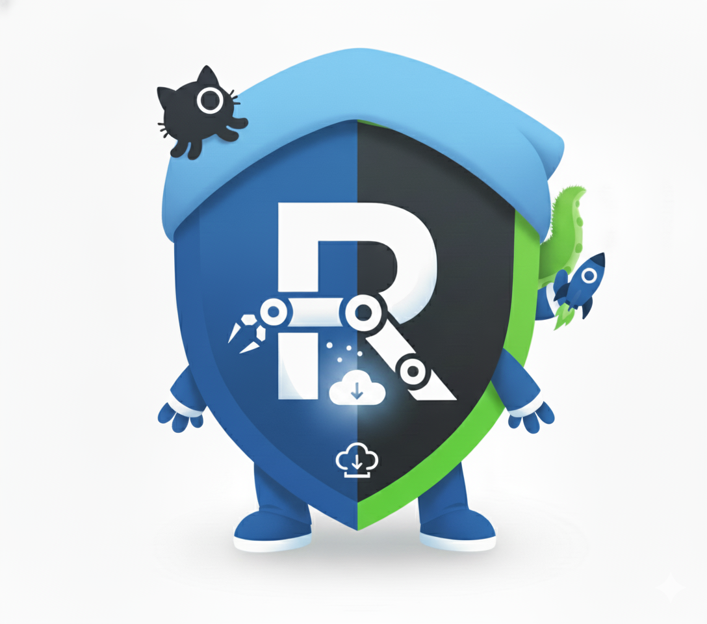

# 🤝 Contributing to Microsoft Rewards Script

<div align="center">



**Thank you for considering contributing to this project!**

</div>

---

## 📋 Table of Contents

- [Code of Conduct](#code-of-conduct)
- [How Can I Contribute?](#how-can-i-contribute)
- [Development Setup](#development-setup)
- [Pull Request Process](#pull-request-process)
- [Coding Standards](#coding-standards)
- [Documentation](#documentation)

---

## 🤝 Code of Conduct

This project follows a simple principle: **Be respectful and constructive**.

- Treat all contributors with respect
- Welcome newcomers and help them learn
- Focus on constructive feedback
- Keep discussions professional and on-topic

---

## 💡 How Can I Contribute?

### 🐛 Reporting Bugs

Before creating a bug report:
- Check existing issues to avoid duplicates
- Gather diagnostic information (see [Diagnostics Guide](docs/diagnostics.md))

**Good bug reports include:**
- Clear title and description
- Steps to reproduce
- Expected vs actual behavior
- Environment details (OS, Node.js version, script version)
- Logs and screenshots (remember to redact sensitive info!)

### ✨ Suggesting Features

Feature suggestions are welcome! Please:
- Check if the feature already exists or is planned
- Explain the use case and benefits
- Consider backward compatibility
- Be open to discussion and alternatives

### 📝 Improving Documentation

Documentation improvements are highly valued:
- Fix typos or unclear instructions
- Add examples or clarifications
- Translate content (if applicable)
- Update outdated information

### 💻 Code Contributions

Contributions to the codebase are welcome! See [Development Setup](#development-setup) below.

---

## 🛠️ Development Setup

### Prerequisites

- Node.js 20+ (version 22 recommended)
- Git
- A code editor (VS Code recommended)

### Getting Started

1. **Fork the repository** on GitHub

2. **Clone your fork:**
   ```bash
   git clone https://github.com/YOUR_USERNAME/Microsoft-Rewards-Script.git
   cd Microsoft-Rewards-Script
   ```

3. **Install dependencies:**
   ```bash
   npm install
   ```

4. **Set up configuration:**
   ```bash
   cp src/accounts.example.jsonc src/accounts.jsonc
   # Edit accounts.jsonc with test credentials
   ```

5. **Build the project:**
   ```bash
   npm run build
   ```

6. **Run in development mode:**
   ```bash
   npm run dev
   ```

### Project Structure

```
src/
├── browser/          # Browser automation (Playwright)
├── functions/        # Core features (activities, login, workers)
│   └── activities/   # Individual activity handlers
├── interface/        # TypeScript interfaces
└── util/             # Utility classes (logging, analytics, etc.)
```

---

## 🔄 Pull Request Process

### Before Submitting

1. **Create a feature branch:**
   ```bash
   git checkout -b feature/your-feature-name
   ```

2. **Make your changes:**
   - Write clean, documented code
   - Follow existing code style
   - Add comments for complex logic

3. **Test your changes:**
   ```bash
   npm run build
   npm run start
   ```

4. **Commit your changes:**
   ```bash
   git add .
   git commit -m "feat: add amazing new feature"
   ```
   
   Use conventional commits:
   - `feat:` for new features
   - `fix:` for bug fixes
   - `docs:` for documentation
   - `refactor:` for code refactoring
   - `test:` for tests
   - `chore:` for maintenance tasks

### Submitting the PR

1. **Push to your fork:**
   ```bash
   git push origin feature/your-feature-name
   ```

2. **Create a Pull Request** on GitHub:
   - Provide a clear title and description
   - Reference any related issues
   - Explain what changed and why
   - Include screenshots/examples if applicable

3. **Respond to feedback:**
   - Be open to suggestions
   - Make requested changes promptly
   - Keep the discussion focused and professional

### PR Review Process

- Maintainers will review your PR as soon as possible
- Changes may be requested before merging
- Once approved, a maintainer will merge your contribution

---

## 📐 Coding Standards

### TypeScript Style

- **Indentation:** 2 spaces (no tabs)
- **Quotes:** Single quotes for strings
- **Semicolons:** Required
- **Naming:**
  - `camelCase` for variables and functions
  - `PascalCase` for classes and interfaces
  - `UPPER_CASE` for constants

### Best Practices

- Write self-documenting code with clear variable names
- Add comments for complex logic
- Keep functions small and focused (single responsibility)
- Handle errors gracefully
- Avoid code duplication
- Use TypeScript types properly (avoid `any` when possible)

### Example

```typescript
// ✅ Good
async function calculateRewardPoints(account: Account): Promise<number> {
  try {
    const points = await fetchPointsFromAPI(account);
    return points;
  } catch (error) {
    this.log.error('POINTS-FETCH', `Failed to fetch points: ${error.message}`);
    return 0;
  }
}

// ❌ Bad
async function calc(a: any): Promise<any> {
  const p = await fetch(a);
  return p;
}
```

---

## 📚 Documentation

### Documentation Standards

- Keep documentation clear and concise
- Use examples wherever possible
- Update documentation when changing functionality
- Follow the existing documentation structure

### Documentation Files

- `README.md` — Main project overview and quick start
- `docs/*.md` — Detailed guides for specific topics
- Code comments — Inline documentation for complex logic

### Writing Style

- Use clear, simple language
- Break complex topics into steps
- Include code examples
- Add visual aids (screenshots, diagrams) when helpful
- Use emojis sparingly for visual navigation

---

## 🧪 Testing

Currently, this project doesn't have a formal test suite. If you'd like to contribute tests:

- Use a testing framework (Jest, Mocha, etc.)
- Write unit tests for utility functions
- Consider integration tests for critical flows
- Document how to run tests

---

## 🐛 Debugging

When debugging issues:

1. Enable diagnostics in `config.jsonc`:
   ```jsonc
   {
     "diagnostics": {
       "enabled": true,
       "saveScreenshot": true,
       "saveHtml": true
     }
   }
   ```

2. Check logs in the console and `reports/` folder

3. Use VS Code debugger with launch configuration

---

## 💬 Getting Help

- **Discord:** [Join our community](https://discord.gg/kn3695Kx32)
- **GitHub Issues:** Ask questions or report problems
- **Documentation:** Check the [docs folder](docs/index.md)

---

## 🎯 Contribution Ideas

Not sure where to start? Here are some ideas:

### Beginner-Friendly

- Fix typos in documentation
- Improve error messages
- Add code comments
- Create examples or tutorials

### Intermediate

- Refactor complex functions
- Improve error handling
- Add new configuration options
- Optimize performance

### Advanced

- Implement new activity types
- Enhance anti-detection mechanisms
- Add comprehensive testing
- Improve Docker deployment

---

## 🙏 Recognition

Contributors will be:
- Listed in the project's contributors page
- Mentioned in release notes (for significant contributions)
- Appreciated by the community! 🌟

---

## 📄 License

---

## 📄 License

By contributing, you agree that your contributions will be licensed under the same [Non-Commercial Personal Use License](LICENSE) as the project.

---

---

<div align="center">

**Thank you for contributing!** 🎉

[Back to README](README.md) • [Documentation](docs/index.md) • [Discord](https://discord.gg/kn3695Kx32)

</div>
